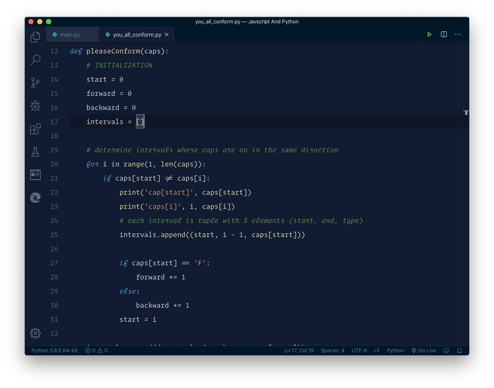
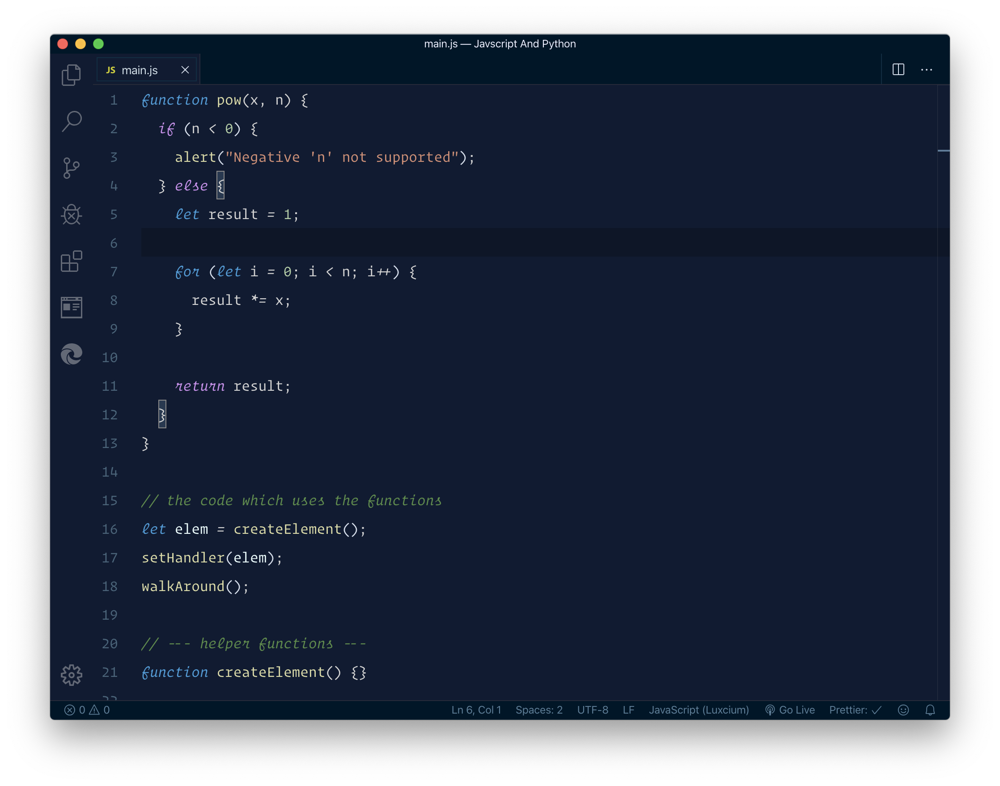

# A Visual Studio Code theme based on Repl.it IDE

> It's a work in progress, as of now it works with Javascript and Python

## Installation

- To start using this extension with Visual Studio Code, clone this repo and copy it into the <user home>/.vscode/extensions folder and restart Code.

---

**Python Screenshot**

**Javascript Screenshot**

> _More language support coming soon..._

If I missed anything please feel free to file an issue! or contribute.

Get in Touch

[Twitter](https://twitter.com/manigandancodes) **_manigandancodes_**
